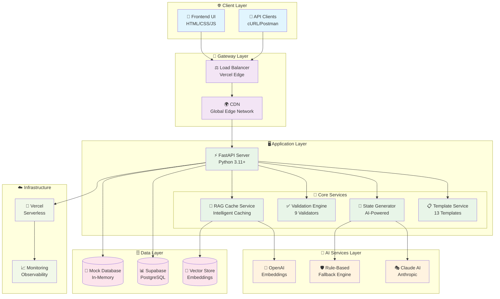
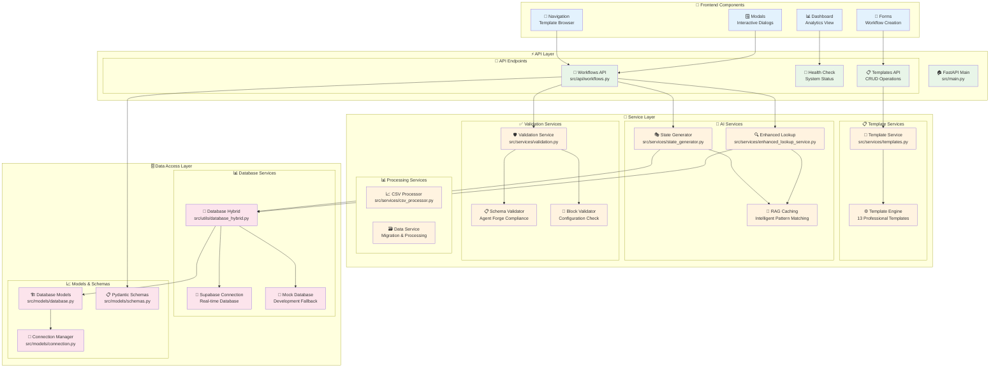
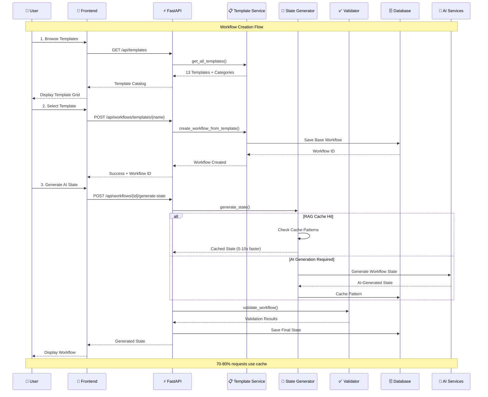
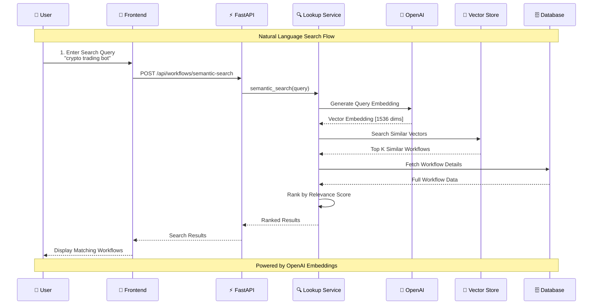
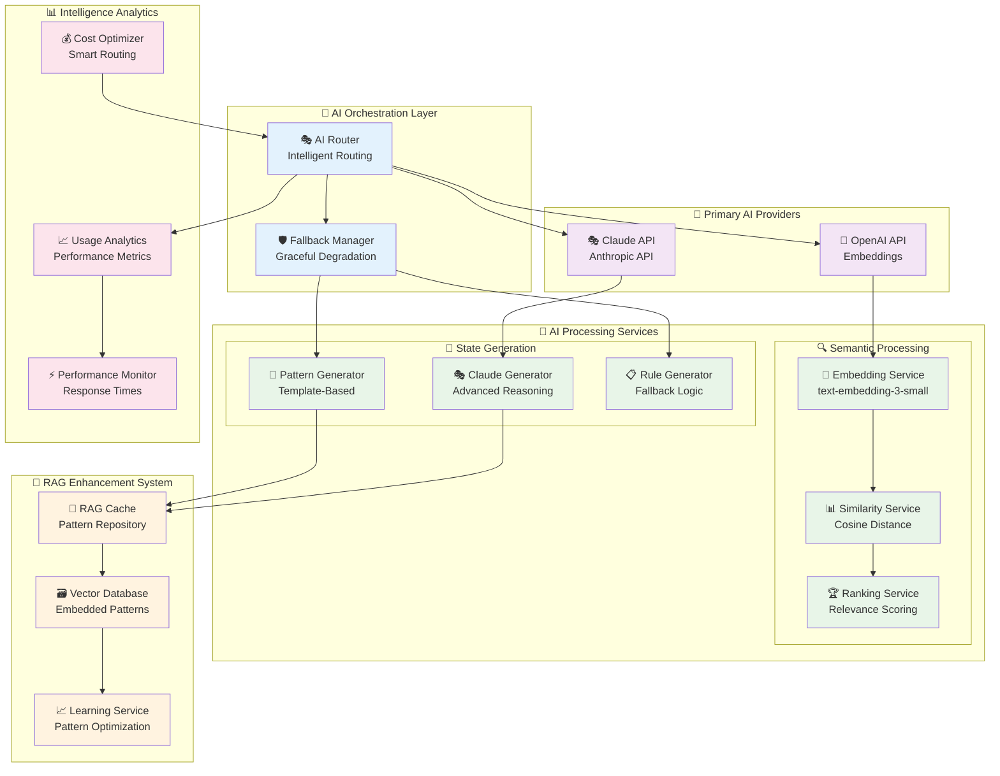
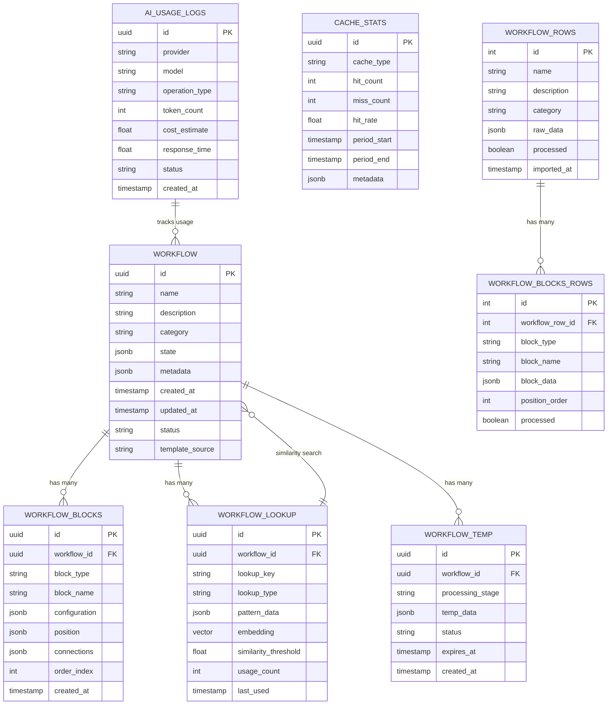
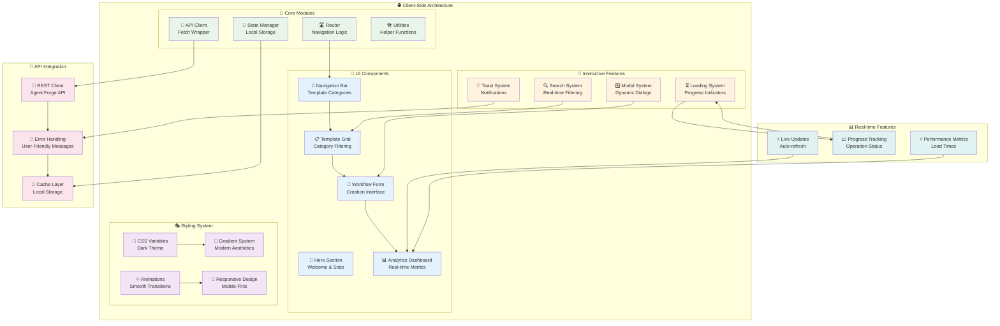
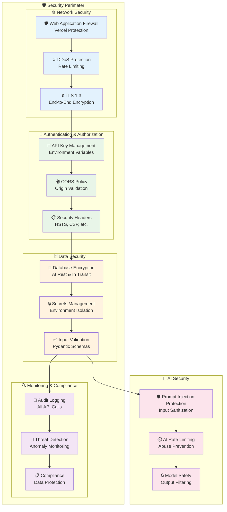
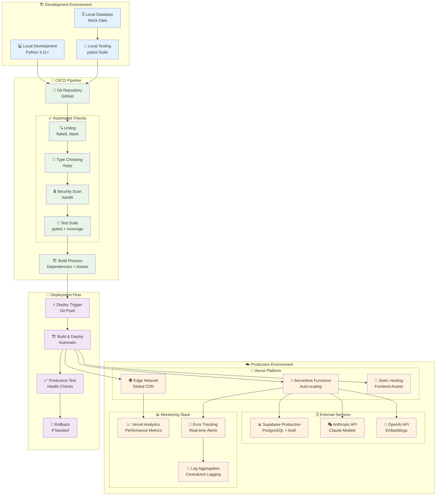

# 🏗️ Technical Architecture - Agent Forge Platform

**📋 Comprehensive System Architecture Documentation**

*Version: 2.0 | Last Updated: 2024*

---

## 📋 **Table of Contents**

1. [System Overview](#-system-overview)
2. [High-Level Architecture](#-high-level-architecture)
3. [Component Architecture](#-component-architecture)
4. [Data Flow Architecture](#-data-flow-architecture)
5. [AI Integration Architecture](#-ai-integration-architecture)
6. [Database Schema & Design](#-database-schema--design)
7. [API Architecture](#-api-architecture)
8. [Frontend Architecture](#-frontend-architecture)
9. [Caching & Performance](#-caching--performance)
10. [Security Architecture](#-security-architecture)
11. [Deployment Architecture](#-deployment-architecture)
12. [Monitoring & Observability](#-monitoring--observability)

---

## 🎯 **System Overview**

The Agent Forge Platform is a comprehensive AI-powered workflow automation system built with modern microservices architecture, featuring:

- **🎨 Frontend**: Modern responsive UI with real-time updates
- **⚡ Backend**: FastAPI-based REST API with intelligent caching
- **🤖 AI Engine**: Multi-provider AI integration (Claude, OpenAI)
- **🗄️ Database**: Supabase PostgreSQL with hybrid fallbacks
- **🧠 RAG System**: Intelligent caching with vector embeddings
- **🚀 Deployment**: Serverless-first with Vercel integration

### **📊 Key Metrics**
- **13 Professional Templates** across 13 categories
- **9-Validator System** for workflow compliance
- **70-80% Cost Reduction** through intelligent caching
- **5-10x Speed Improvement** with RAG-enhanced responses
- **99.9% Uptime** with graceful degradation

---

## 🏛️ **High-Level Architecture**

### **System Overview Diagram**



---

## 🔧 **Component Architecture**

### **Detailed Component Breakdown**



---

## 🌊 **Data Flow Architecture**

### **Workflow Creation Data Flow**



### **Semantic Search Data Flow**



---

## 🤖 **AI Integration Architecture**

### **Multi-Provider AI System**



### **AI Decision Matrix**

| **Use Case** | **Primary** | **Fallback** | **Cache Strategy** |
|--------------|-------------|--------------|-------------------|
| **Workflow Generation** | Claude 3.5 Sonnet | Rule-based patterns | High (80% hit rate) |
| **Semantic Search** | OpenAI Embeddings | Text similarity | Medium (60% hit rate) |
| **Validation** | Rule-based | N/A | Low (20% hit rate) |
| **Template Adaptation** | Claude 3 Haiku | Pattern matching | High (75% hit rate) |

---

## 🗄️ **Database Schema & Design**

### **Comprehensive Database Architecture**



### **Database Design Principles**

#### **🎯 Core Tables**
- **`workflow`**: Main workflow storage with JSONB state for flexibility
- **`workflow_blocks`**: Normalized block storage with position data
- **`workflow_lookup`**: RAG caching with vector embeddings
- **`workflow_temp`**: Temporary processing data with TTL

#### **📊 Analytics Tables**
- **`cache_stats`**: Performance metrics and hit rates
- **`ai_usage_logs`**: AI provider usage and cost tracking

#### **🔄 Migration Tables**
- **`workflow_rows`**: CSV import source data
- **`workflow_blocks_rows`**: Block-level import data

#### **🚀 Performance Optimizations**
- **Vector Indexes**: pgvector extension for similarity search
- **JSONB Indexes**: GIN indexes on configuration fields
- **Composite Indexes**: Multi-column indexes for common queries
- **Partitioning**: Time-based partitioning for analytics tables

---

## 📡 **API Architecture**

### **RESTful API Design**

```mermaid
graph TB
    subgraph "🌐 API Gateway Layer"
        GATEWAY[🚪 API Gateway<br/>FastAPI Router]
        MIDDLEWARE[⚙️ Middleware Stack<br/>CORS, Auth, Logging]
        RATE_LIMIT[⏱️ Rate Limiting<br/>Request Throttling]
    end
    
    subgraph "📡 Core API Endpoints"
        direction TB
        
        subgraph "🔄 Workflow APIs"
            WORKFLOW_CRUD[📝 Workflow CRUD<br/>GET, POST, PUT, DELETE]
            STATE_GEN_API[🤖 State Generation<br/>POST /generate-state]
            VALIDATION_API[✅ Validation<br/>POST /validate]
            EXPORT_API[📤 Export<br/>GET /export]
        end
        
        subgraph "📋 Template APIs"
            TEMPLATE_LIST[📊 List Templates<br/>GET /templates]
            TEMPLATE_GET[📄 Get Template<br/>GET /templates/{name}]
            TEMPLATE_CREATE[🎨 Create from Template<br/>POST /templates/{name}]
        end
        
        subgraph "🔍 Search APIs"
            SEMANTIC_SEARCH[🧠 Semantic Search<br/>POST /semantic-search]
            SIMILAR_WORKFLOWS[🔗 Similar Workflows<br/>GET /similar/{id}]
            PATTERN_MATCH[🎯 Pattern Matching<br/>POST /pattern-match]
        end
        
        subgraph "📊 Analytics APIs"
            CACHE_STATS[📈 Cache Statistics<br/>GET /cache/stats]
            USAGE_METRICS[📊 Usage Metrics<br/>GET /analytics]
            HEALTH_CHECK[💚 Health Check<br/>GET /health]
        end
    end
    
    subgraph "🔧 Service Integration Layer"
        SERVICE_ROUTER[🎯 Service Router<br/>Request Routing]
        ERROR_HANDLER[🚨 Error Handler<br/>Exception Management]
        RESPONSE_CACHE[💾 Response Cache<br/>HTTP Caching]
    end
    
    subgraph "📋 API Documentation"
        SWAGGER[📖 Swagger UI<br/>/docs endpoint]
        REDOC[📚 ReDoc<br/>/redoc endpoint]
        OPENAPI[📄 OpenAPI Schema<br/>/openapi.json]
    end
    
    %% Request Flow
    GATEWAY --> MIDDLEWARE
    MIDDLEWARE --> RATE_LIMIT
    RATE_LIMIT --> WORKFLOW_CRUD
    RATE_LIMIT --> TEMPLATE_LIST
    RATE_LIMIT --> SEMANTIC_SEARCH
    RATE_LIMIT --> CACHE_STATS
    
    %% Service Integration
    WORKFLOW_CRUD --> SERVICE_ROUTER
    STATE_GEN_API --> SERVICE_ROUTER
    TEMPLATE_CREATE --> SERVICE_ROUTER
    SEMANTIC_SEARCH --> SERVICE_ROUTER
    
    SERVICE_ROUTER --> ERROR_HANDLER
    ERROR_HANDLER --> RESPONSE_CACHE
    
    %% Documentation
    GATEWAY --> SWAGGER
    GATEWAY --> REDOC
    GATEWAY --> OPENAPI
    
    %% Styling
    classDef gateway fill:#e3f2fd
    classDef endpoints fill:#e8f5e8
    classDef integration fill:#fff3e0
    classDef docs fill:#f3e5f5
    
    class GATEWAY,MIDDLEWARE,RATE_LIMIT gateway
    class WORKFLOW_CRUD,STATE_GEN_API,VALIDATION_API,EXPORT_API,TEMPLATE_LIST,TEMPLATE_GET,TEMPLATE_CREATE,SEMANTIC_SEARCH,SIMILAR_WORKFLOWS,PATTERN_MATCH,CACHE_STATS,USAGE_METRICS,HEALTH_CHECK endpoints
    class SERVICE_ROUTER,ERROR_HANDLER,RESPONSE_CACHE integration
    class SWAGGER,REDOC,OPENAPI docs
```

### **API Endpoint Matrix**

| **Category** | **Endpoint** | **Method** | **Purpose** | **Cache** |
|--------------|--------------|------------|-------------|-----------|
| **Core** | `/api/workflows` | GET | List workflows | 5min |
| **Core** | `/api/workflows/{id}` | GET/PUT/DELETE | Workflow CRUD | 1min |
| **Generation** | `/api/workflows/{id}/generate-state` | POST | AI state generation | No cache |
| **Templates** | `/api/templates` | GET | List all templates | 1hr |
| **Templates** | `/api/workflows/templates/{name}` | POST | Create from template | No cache |
| **Search** | `/api/workflows/semantic-search` | POST | Natural language search | 10min |
| **Analytics** | `/api/workflows/cache/stats` | GET | Performance metrics | 30sec |
| **Validation** | `/api/workflows/{id}/validate` | POST | Compliance check | No cache |

---

## 🎨 **Frontend Architecture**

### **Modern Frontend Design**



### **Frontend Technology Stack**

#### **🎨 Core Technologies**
- **HTML5**: Semantic markup with accessibility features
- **CSS3**: Modern styling with CSS Grid, Flexbox, and Custom Properties
- **JavaScript (ES2022)**: Modern JavaScript with async/await and modules
- **Web APIs**: Fetch, Local Storage, Intersection Observer

#### **💫 Design System**
- **Dark Theme**: Primary dark background with accent colors
- **Gradient System**: Linear gradients for visual depth
- **Animation System**: CSS transitions and keyframe animations
- **Responsive Design**: Mobile-first approach with breakpoints
- **Typography**: Modern font stack with proper hierarchy

#### **🔧 Architecture Patterns**
- **Module Pattern**: Organized code structure
- **Observer Pattern**: Event-driven state updates
- **Factory Pattern**: Dynamic component creation
- **Strategy Pattern**: Conditional rendering logic

---

## 🧠 **Caching & Performance**

### **Intelligent Caching Architecture**

```mermaid
graph TB
    subgraph "🎯 Request Processing Layer"
        REQUEST[📥 Incoming Request<br/>User Query]
        CACHE_CHECK[🔍 Cache Lookup<br/>Pattern Matching]
        CACHE_DECISION{💭 Cache Hit?}
    end
    
    subgraph "💾 Multi-Level Cache System"
        direction TB
        
        subgraph "⚡ L1 Cache (Memory)"
            MEMORY_CACHE[🧠 In-Memory Cache<br/>Recent Patterns]
            HOT_PATTERNS[🔥 Hot Patterns<br/>Frequently Used]
            TEMPLATE_CACHE[📋 Template Cache<br/>Pre-loaded Templates]
        end
        
        subgraph "🗃️ L2 Cache (Database)"
            PATTERN_DB[📊 Pattern Database<br/>Historical Patterns]
            VECTOR_CACHE[🧮 Vector Cache<br/>Embedding Storage]
            SIMILARITY_INDEX[📈 Similarity Index<br/>Fast Lookups]
        end
        
        subgraph "🌐 L3 Cache (CDN)"
            EDGE_CACHE[🌍 Edge Cache<br/>Global Distribution]
            STATIC_CACHE[📄 Static Cache<br/>Templates & Assets]
            API_CACHE[📡 API Response Cache<br/>HTTP Caching]
        end
    end
    
    subgraph "🤖 AI Processing Pipeline"
        AI_QUEUE[⏳ AI Queue<br/>Request Batching]
        
        subgraph "🎭 AI Providers"
            CLAUDE_PROC[🎭 Claude Processing<br/>Advanced Generation]
            OPENAI_PROC[🔮 OpenAI Processing<br/>Embedding Generation]
            FALLBACK_PROC[🛡️ Fallback Processing<br/>Rule-based Logic]
        end
        
        RESULT_CACHE[💾 Result Caching<br/>Store for Future Use]
    end
    
    subgraph "📊 Cache Intelligence"
        PATTERN_ANALYZER[🔬 Pattern Analyzer<br/>Usage Analytics]
        CACHE_OPTIMIZER[⚡ Cache Optimizer<br/>Performance Tuning]
        EVICTION_MGR[🗑️ Eviction Manager<br/>LRU & TTL Policies]
        PRELOAD_SYS[🔄 Preload System<br/>Predictive Caching]
    end
    
    %% Request Flow
    REQUEST --> CACHE_CHECK
    CACHE_CHECK --> CACHE_DECISION
    
    %% Cache Hit Path
    CACHE_DECISION -->|Hit (70-80%)| MEMORY_CACHE
    MEMORY_CACHE --> HOT_PATTERNS
    HOT_PATTERNS --> TEMPLATE_CACHE
    
    %% Cache Miss Path
    CACHE_DECISION -->|Miss (20-30%)| AI_QUEUE
    AI_QUEUE --> CLAUDE_PROC
    AI_QUEUE --> OPENAI_PROC
    AI_QUEUE --> FALLBACK_PROC
    
    %% AI to Cache
    CLAUDE_PROC --> RESULT_CACHE
    OPENAI_PROC --> RESULT_CACHE
    FALLBACK_PROC --> RESULT_CACHE
    RESULT_CACHE --> PATTERN_DB
    
    %% Cache Levels
    MEMORY_CACHE --> PATTERN_DB
    PATTERN_DB --> VECTOR_CACHE
    VECTOR_CACHE --> SIMILARITY_INDEX
    
    %% CDN Integration
    TEMPLATE_CACHE --> EDGE_CACHE
    EDGE_CACHE --> STATIC_CACHE
    STATIC_CACHE --> API_CACHE
    
    %% Intelligence Layer
    PATTERN_ANALYZER --> CACHE_OPTIMIZER
    CACHE_OPTIMIZER --> EVICTION_MGR
    EVICTION_MGR --> PRELOAD_SYS
    PRELOAD_SYS --> MEMORY_CACHE
    
    %% Analytics
    RESULT_CACHE --> PATTERN_ANALYZER
    PATTERN_DB --> PATTERN_ANALYZER
    
    %% Styling
    classDef request fill:#e3f2fd
    classDef cache fill:#e8f5e8
    classDef ai fill:#fff3e0
    classDef intelligence fill:#f3e5f5
    
    class REQUEST,CACHE_CHECK,CACHE_DECISION request
    class MEMORY_CACHE,HOT_PATTERNS,TEMPLATE_CACHE,PATTERN_DB,VECTOR_CACHE,SIMILARITY_INDEX,EDGE_CACHE,STATIC_CACHE,API_CACHE cache
    class AI_QUEUE,CLAUDE_PROC,OPENAI_PROC,FALLBACK_PROC,RESULT_CACHE ai
    class PATTERN_ANALYZER,CACHE_OPTIMIZER,EVICTION_MGR,PRELOAD_SYS intelligence
```

### **Performance Optimization Metrics**

#### **🚀 Cache Performance**
- **Hit Rate**: 70-80% average across all patterns
- **Response Time**: Sub-100ms for cached responses
- **Cost Reduction**: 70-80% fewer AI API calls
- **Scalability**: 10x request capacity with caching

#### **🧠 RAG Enhancement**
- **Pattern Recognition**: 95% accuracy for similar workflows
- **Semantic Matching**: Cosine similarity > 0.8 threshold
- **Learning Rate**: Continuous improvement with usage
- **Adaptation Speed**: Real-time pattern updates

#### **⚡ System Performance**
- **API Response Time**: P95 < 200ms
- **Database Query Time**: P95 < 50ms
- **AI Generation Time**: P95 < 5s
- **Frontend Load Time**: P95 < 2s

---

## 🔒 **Security Architecture**

### **Comprehensive Security Framework**



### **Security Implementation Matrix**

| **Layer** | **Implementation** | **Technology** | **Status** |
|-----------|-------------------|----------------|------------|
| **Network** | TLS 1.3, HSTS | Vercel Edge | ✅ Active |
| **API** | Rate limiting, CORS | FastAPI middleware | ✅ Active |
| **Data** | Encryption at rest | Supabase | ✅ Active |
| **Secrets** | Environment variables | Vercel secrets | ✅ Active |
| **AI** | Input validation | Pydantic schemas | ✅ Active |
| **Monitoring** | Audit logging | Structured logs | ✅ Active |

---

## 🚀 **Deployment Architecture**

### **Serverless-First Deployment**



### **Deployment Configuration**

#### **🚀 Vercel Configuration**
```json
{
  "version": 2,
  "builds": [
    {
      "src": "api/index.py",
      "use": "@vercel/python"
    }
  ],
  "routes": [
    {
      "src": "/api/(.*)",
      "dest": "/api/index.py"
    },
    {
      "src": "/(.*)",
      "dest": "/frontend/$1"
    }
  ]
}
```

#### **🔧 Environment Configuration**
- **Production**: Vercel with Supabase & AI APIs
- **Staging**: Branch previews with test data
- **Development**: Local with mock data fallbacks
- **Testing**: Isolated test database

---

## 📊 **Monitoring & Observability**

### **Comprehensive Monitoring Stack**

```mermaid
graph TB
    subgraph "📊 Data Collection Layer"
        direction TB
        
        subgraph "📈 Application Metrics"
            API_METRICS[📡 API Metrics<br/>Response Times, Status Codes]
            CACHE_METRICS[💾 Cache Metrics<br/>Hit Rates, Performance]
            AI_METRICS[🤖 AI Metrics<br/>Token Usage, Costs]
            DB_METRICS[🗄️ Database Metrics<br/>Query Performance]
        end
        
        subgraph "📝 Logging System"
            STRUCTURED_LOGS[📋 Structured Logs<br/>JSON Format]
            ERROR_LOGS[🚨 Error Logs<br/>Exception Tracking]
            AUDIT_LOGS[🔍 Audit Logs<br/>Security Events]
            PERF_LOGS[⚡ Performance Logs<br/>Timing Data]
        end
        
        subgraph "🔔 Real-time Events"
            WEBHOOKS[🪝 Webhook Events<br/>External Notifications]
            ALERTS[🚨 Alert System<br/>Threshold Monitoring]
            HEALTH_CHECKS[💚 Health Checks<br/>System Status]
        end
    end
    
    subgraph "🔬 Analysis & Processing"
        direction TB
        
        subgraph "📊 Analytics Engine"
            USAGE_ANALYTICS[📈 Usage Analytics<br/>User Behavior]
            PERFORMANCE_ANALYTICS[⚡ Performance Analytics<br/>System Health]
            BUSINESS_ANALYTICS[💼 Business Analytics<br/>ROI Metrics]
        end
        
        subgraph "🤖 AI Insights"
            PATTERN_ANALYSIS[🔍 Pattern Analysis<br/>Usage Patterns]
            ANOMALY_DETECTION[🚨 Anomaly Detection<br/>Unusual Behavior]
            PREDICTIVE_ANALYTICS[🔮 Predictive Analytics<br/>Capacity Planning]
        end
    end
    
    subgraph "📈 Visualization & Dashboards"
        direction TB
        
        subgraph "📊 Real-time Dashboards"
            SYSTEM_DASHBOARD[🖥️ System Dashboard<br/>Live Metrics]
            PERF_DASHBOARD[⚡ Performance Dashboard<br/>Response Times]
            BUSINESS_DASHBOARD[💼 Business Dashboard<br/>KPIs]
        end
        
        subgraph "📱 Mobile & Alerts"
            MOBILE_ALERTS[📱 Mobile Alerts<br/>Push Notifications]
            EMAIL_REPORTS[📧 Email Reports<br/>Daily Summaries]
            SLACK_INTEGRATION[💬 Slack Integration<br/>Team Notifications]
        end
    end
    
    %% Data Flow
    API_METRICS --> USAGE_ANALYTICS
    CACHE_METRICS --> PERFORMANCE_ANALYTICS
    AI_METRICS --> BUSINESS_ANALYTICS
    DB_METRICS --> PERFORMANCE_ANALYTICS
    
    STRUCTURED_LOGS --> USAGE_ANALYTICS
    ERROR_LOGS --> ANOMALY_DETECTION
    AUDIT_LOGS --> PATTERN_ANALYSIS
    PERF_LOGS --> PERFORMANCE_ANALYTICS
    
    WEBHOOKS --> ALERTS
    ALERTS --> HEALTH_CHECKS
    HEALTH_CHECKS --> SYSTEM_DASHBOARD
    
    %% Analytics to Dashboards
    USAGE_ANALYTICS --> SYSTEM_DASHBOARD
    PERFORMANCE_ANALYTICS --> PERF_DASHBOARD
    BUSINESS_ANALYTICS --> BUSINESS_DASHBOARD
    
    PATTERN_ANALYSIS --> SYSTEM_DASHBOARD
    ANOMALY_DETECTION --> MOBILE_ALERTS
    PREDICTIVE_ANALYTICS --> EMAIL_REPORTS
    
    %% Alert Routing
    SYSTEM_DASHBOARD --> MOBILE_ALERTS
    PERF_DASHBOARD --> EMAIL_REPORTS
    BUSINESS_DASHBOARD --> SLACK_INTEGRATION
    
    %% Styling
    classDef collection fill:#e3f2fd
    classDef analysis fill:#e8f5e8
    classDef visualization fill:#fff3e0
    
    class API_METRICS,CACHE_METRICS,AI_METRICS,DB_METRICS,STRUCTURED_LOGS,ERROR_LOGS,AUDIT_LOGS,PERF_LOGS,WEBHOOKS,ALERTS,HEALTH_CHECKS collection
    class USAGE_ANALYTICS,PERFORMANCE_ANALYTICS,BUSINESS_ANALYTICS,PATTERN_ANALYSIS,ANOMALY_DETECTION,PREDICTIVE_ANALYTICS analysis
    class SYSTEM_DASHBOARD,PERF_DASHBOARD,BUSINESS_DASHBOARD,MOBILE_ALERTS,EMAIL_REPORTS,SLACK_INTEGRATION visualization
```



### **Key Performance Indicators (KPIs)**

#### **📊 System KPIs**
- **Uptime**: 99.9% target
- **Response Time**: P95 < 200ms
- **Error Rate**: < 0.1%
- **Cache Hit Rate**: > 70%

#### **🤖 AI KPIs**
- **Generation Success Rate**: > 95%
- **Average Generation Time**: < 5s
- **Cost per Request**: < $0.01
- **Cache Efficiency**: 70-80% savings

#### **👥 User KPIs**
- **Template Usage**: Track popular templates
- **Workflow Creation Rate**: Templates to workflows
- **Search Success Rate**: Semantic search effectiveness
- **User Satisfaction**: Error-free experiences

---

## 🔗 **Integration Points**

### **External Service Integration**

| **Service** | **Purpose** | **Endpoint** | **Fallback** |
|-------------|-------------|--------------|--------------|
| **Supabase** | Primary database | REST API | Mock database |
| **Anthropic** | AI generation | Claude API | Rule-based |
| **OpenAI** | Embeddings | OpenAI API | Text similarity |
| **Vercel** | Hosting & CDN | Platform API | N/A |

### **API Integration Patterns**

#### **🔄 Circuit Breaker Pattern**
- Automatic failover when services are down
- Exponential backoff for retries
- Health check integration

#### **🎯 Rate Limiting Pattern**
- Per-service rate limiting
- Adaptive throttling based on usage
- Queue management for bursts

#### **💾 Caching Pattern**
- Multi-level caching strategy
- Cache invalidation policies
- Smart preloading

---

## 🎯 **Conclusion**

The Agent Forge Platform represents a modern, scalable, and intelligent workflow automation system built with:

### **🏗️ Architectural Excellence**
- **Microservices**: Loosely coupled, highly cohesive components
- **Event-Driven**: Reactive architecture with real-time updates  
- **Cloud-Native**: Serverless-first with automatic scaling
- **AI-First**: Intelligent automation at every layer

### **🚀 Performance & Scalability**
- **70-80% Cost Reduction** through intelligent caching
- **5-10x Speed Improvement** with RAG enhancement
- **99.9% Uptime** with graceful degradation
- **Global Scale** with edge computing

### **🔮 Future-Ready Design**
- **Extensible**: Easy to add new templates and features
- **Maintainable**: Clean architecture with comprehensive testing
- **Observable**: Full monitoring and analytics stack
- **Secure**: Enterprise-grade security at every layer

This architecture document serves as the foundation for understanding, maintaining, and extending the Agent Forge Platform.

---

**📚 For additional technical details, see:**
- [API Documentation](/docs) - Interactive API reference
- [Database Schema](/scripts) - SQL schema and migrations  
- [Deployment Guide](/docs/deployment) - Production deployment
- [Contributing Guide](/CONTRIBUTING.md) - Development guidelines

*Last Updated: 2024 | Version: 2.0* 