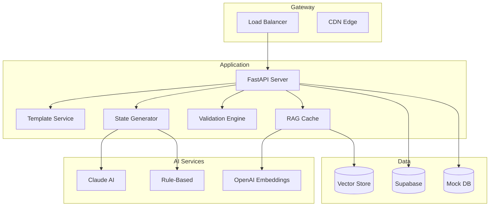
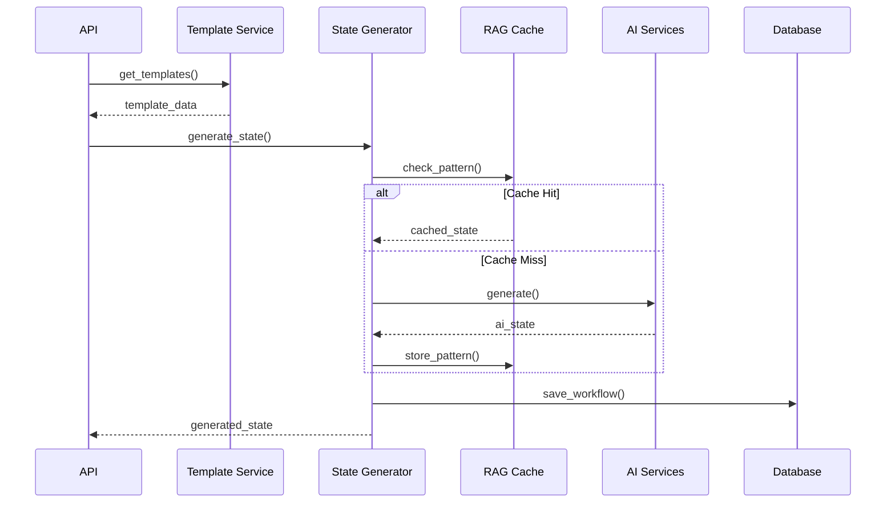
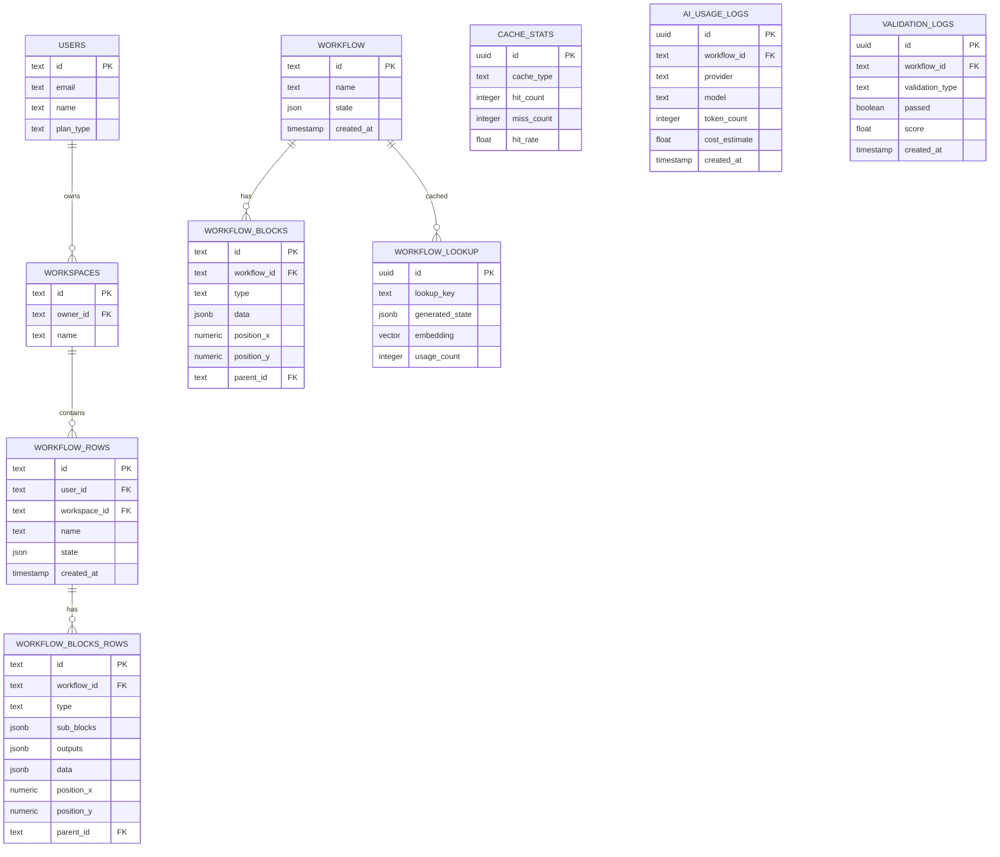

# Technical Architecture - Agent Forge Platform

**System Architecture Documentation v2.0 (Updated 2025-01)**

---

## System Overview

AI-powered workflow automation platform with:

- **Backend**: FastAPI REST API with intelligent caching
- **AI Engine**: Multi-provider integration (Claude, OpenAI)
- **Database**: Supabase PostgreSQL with hybrid fallbacks
- **RAG System**: Vector embeddings for pattern matching
- **Deployment**: Serverless on Vercel

### Key Metrics
- 13 professional templates
- 9-validator compliance system
- 70-80% cost reduction via caching
- 5-10x speed improvement with RAG
- 99.9% uptime target

---

## High-Level Architecture

---

## Component Architecture

### Core Services
- **Template Service**: 13 workflow templates with CRUD operations
- **State Generator**: AI-powered workflow state creation
- **Validation Engine**: 9-validator compliance system
- **RAG Cache**: Pattern recognition and similarity matching

### AI Integration
- **Primary**: Claude 3.5 Sonnet for generation
- **Embeddings**: OpenAI text-embedding-3-small
- **Fallback**: Rule-based pattern generation

### Data Layer (v2.0)
- **Primary**: Supabase PostgreSQL with pgvector
- **Guideline Tables**: `workflow_rows`, `workflow_blocks_rows`
- **Production Tables**: `workflow`, `workflow_blocks`
- **Analytics**: `cache_stats`, `ai_usage_logs`, `validation_logs`
- **Org**: `users`, `workspaces`, `workflow_folders`
- **Views**: `workflow_summary`, `cache_performance`, `ai_usage_summary`
- **Triggers**: Auto-maintain `updated_at`

---

## Data Flow

---

## Database Schema (v2.0)

---

## Migration & Population
- Script: `database/migration.sql`
- Function `generate_workflow_state(workflow_id)` assembles blocks/edges/metadata
- Copies guideline tables → production tables
- Populates cache lookup and analytics logs
- Emits validation and final reports

## Synthetic Data
- File: `database/synthetic-data.sql`
- 10 users, 5 workspaces, 15 workflows, 60+ blocks, analytics samples

## Monitoring & Analytics
- Views for summaries, performance dashboards
- Metrics: P95 latency, cache hit rate, AI cost/time

## Security
- Rate limiting, CORS, header hardening
- Secrets via env vars

## Links
- **API Docs**: https://solidus-olive.vercel.app/api/docs
- **PRD**: `docs/PRD.md`

---

*Architecture v2.0 | Updated 2025-01* 