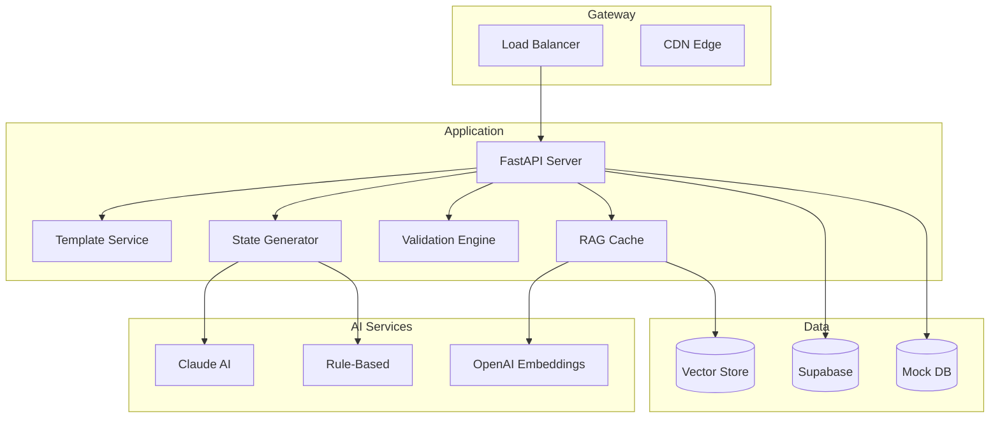
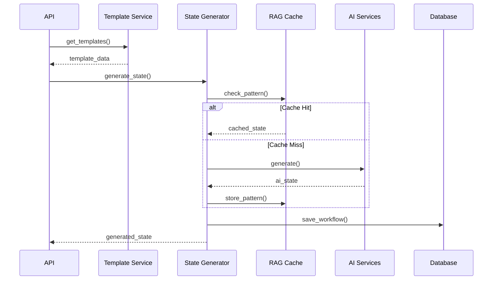
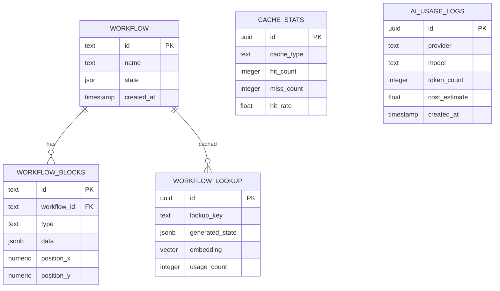
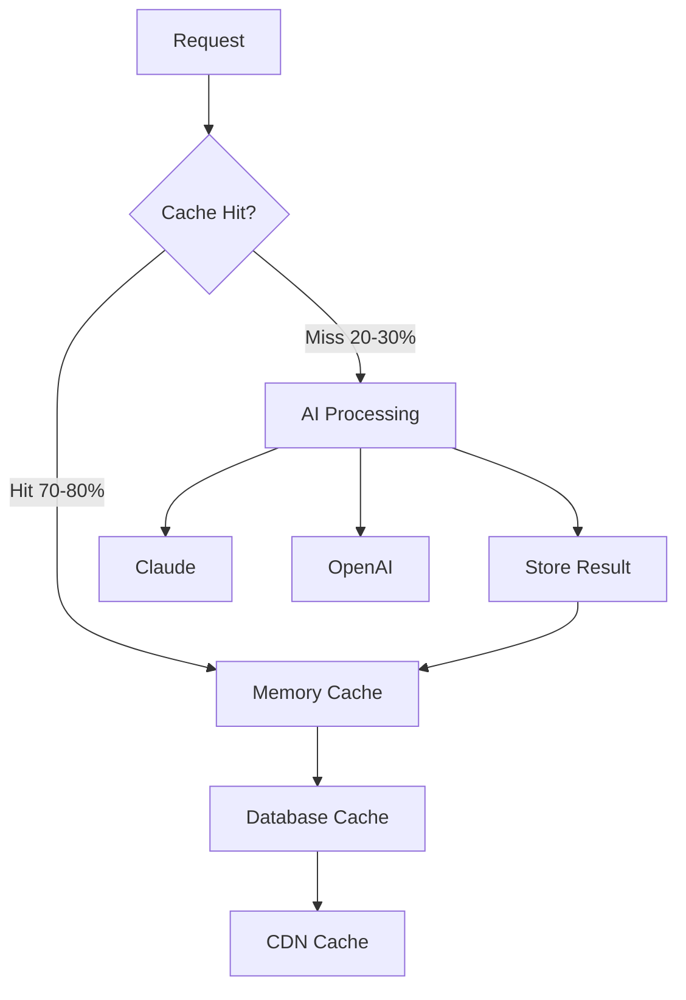
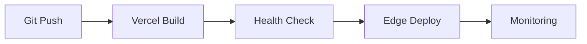

# Technical Architecture - Agent Forge Platform

**System Architecture Documentation v2.0**

---

## System Overview

AI-powered workflow automation platform with:

- **Backend**: FastAPI REST API with intelligent caching
- **AI Engine**: Multi-provider integration (Claude, OpenAI)
- **Database**: Supabase PostgreSQL with hybrid fallbacks
- **RAG System**: Vector embeddings for pattern matching
- **Deployment**: Serverless on Vercel

### Key Metrics
- 13 professional templates
- 9-validator compliance system
- 70-80% cost reduction via caching
- 5-10x speed improvement with RAG
- 99.9% uptime target

---

## High-Level Architecture

---

## Component Architecture

### Core Services
- **Template Service**: 13 workflow templates with CRUD operations
- **State Generator**: AI-powered workflow state creation
- **Validation Engine**: 9-validator compliance system
- **RAG Cache**: Pattern recognition and similarity matching

### AI Integration
- **Primary**: Claude 3.5 Sonnet for generation
- **Embeddings**: OpenAI text-embedding-3-small
- **Fallback**: Rule-based pattern generation

### Data Layer
- **Primary**: Supabase PostgreSQL with pgvector
- **Fallback**: In-memory mock database
- **Caching**: Multi-level (memory, database, CDN)

---

## Data Flow

---

## AI Integration Architecture

### Multi-Provider System

| Provider | Use Case | Fallback |
|----------|----------|----------|
| Claude | Workflow generation | Rule-based |
| OpenAI | Embeddings | Text similarity |
| Rule-based | System fallback | N/A |

### Cost Optimization
- RAG cache hit rate: 70-80%
- Token usage reduction: 70-80%
- Response time improvement: 5-10x

---

## Database Schema

### Core Tables
- **workflow**: Main workflow storage with JSON state
- **workflow_blocks**: Block-level data with positions
- **workflow_lookup**: RAG patterns with embeddings
- **cache_stats**: Performance metrics
- **ai_usage_logs**: AI provider usage tracking

---

## API Architecture

### Endpoint Categories

| Category | Endpoints | Purpose |
|----------|-----------|---------|
| Core | `/api/workflows/*` | CRUD operations |
| Templates | `/api/templates/*` | Template management |
| Generation | `/api/workflows/{id}/generate-state` | AI generation |
| Validation | `/api/workflows/{id}/validate` | Compliance check |
| Search | `/api/workflows/semantic-search` | Semantic queries |
| Analytics | `/api/workflows/cache/stats` | Performance data |

### Response Caching
- Templates: 1 hour
- Workflows: 1 minute  
- Analytics: 30 seconds
- Generation: No cache

---

## Caching Architecture

### Cache Levels
1. **L1 Memory**: Hot patterns, <100ms
2. **L2 Database**: Historical patterns, <50ms  
3. **L3 CDN**: Static assets, edge cached

### Performance Metrics
- Hit rate: 70-80%
- Miss penalty: 5-10x slower
- Cost reduction: 70-80%

---

## Security Architecture

### Security Layers
- **Network**: TLS 1.3, HSTS headers
- **API**: Rate limiting, CORS validation
- **Data**: Encryption at rest and transit
- **Secrets**: Environment variable isolation
- **AI**: Input validation, output filtering

### Implementation
- WAF protection via Vercel
- API keys in environment variables
- Pydantic schema validation
- Structured audit logging

---

## Deployment Architecture

### Serverless Stack
- **Platform**: Vercel Edge Network
- **Functions**: Auto-scaling serverless
- **Database**: Supabase PostgreSQL
- **CDN**: Global edge caching

### CI/CD Pipeline

### Environment Configuration
- **Production**: Full AI integration
- **Preview**: Branch deployments
- **Development**: Mock data fallbacks

---

## Performance Monitoring

### Key Metrics
- **API Response Time**: P95 < 200ms
- **Database Query Time**: P95 < 50ms
- **AI Generation Time**: P95 < 5s
- **Cache Hit Rate**: > 70%

### Monitoring Stack
- **Logs**: Structured JSON logging
- **Metrics**: Vercel Analytics
- **Alerts**: Error rate thresholds
- **Traces**: Request flow tracking

### Analytics Tables
- `cache_stats`: Hit/miss ratios by type
- `ai_usage_logs`: Token usage and costs

---

## Integration Points

### External Services
- **Supabase**: Primary database with pgvector
- **Anthropic**: Claude API for generation
- **OpenAI**: Embeddings API for RAG
- **Vercel**: Hosting and edge network

### Fallback Strategy
- Database: Supabase → Mock data
- AI: Claude → OpenAI → Rule-based
- Cache: Memory → Database → Miss

---

## Technical Specifications

### Technology Stack
- **Runtime**: Python 3.11+
- **Framework**: FastAPI with Uvicorn
- **Database**: PostgreSQL with pgvector
- **AI**: Claude 3.5 Sonnet, OpenAI embeddings
- **Deployment**: Vercel serverless functions

### Performance Targets
- **Availability**: 99.9% uptime
- **Latency**: P95 < 200ms API response
- **Throughput**: 1000+ requests/minute
- **Cost**: <$0.01 per workflow generation

---

*Architecture v2.0 | Updated 2024* 